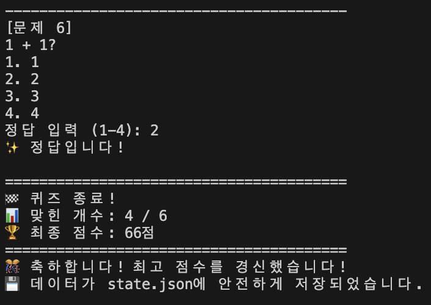
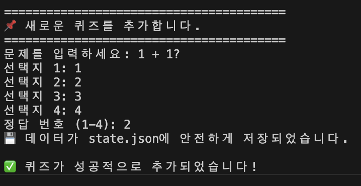
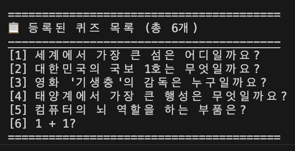
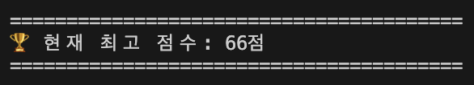
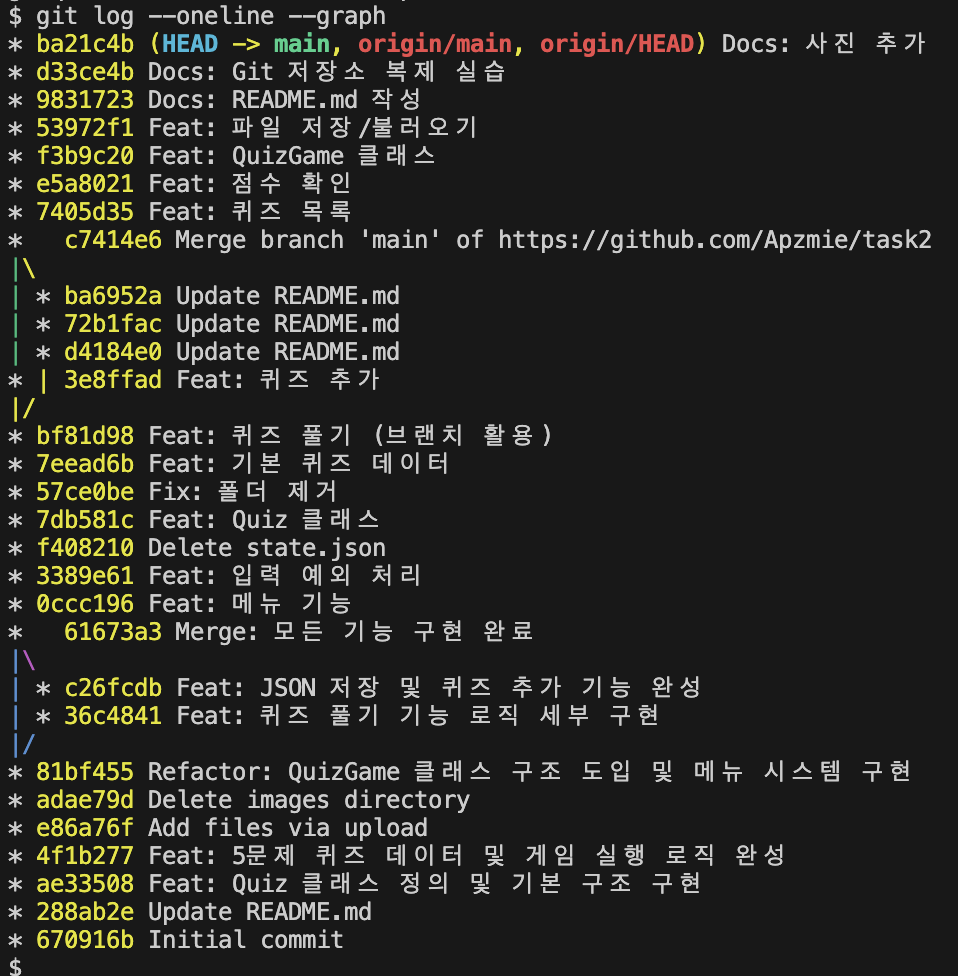

# task2
Python과 Git을 활용하여 데이터 영속성을 구현한 터미널 기반 퀴즈 게임 프로젝트입니다.

1. 프로젝트 개요

설명: 사용자가 퀴즈를 풀고, 직접 새로운 퀴즈를 등록하며 최고 점수를 관리할 수 있는 콘솔 프로그램입니다.

2. 퀴즈 주제 및 선정 이유

주제: 일반 상식 (General Knowledge)

선정 이유:

특정 분야에 치우치지 않아 누구나 쉽게 게임에 참여하고 흥미를 느낄 수 있습니다.

정답이 명확한 데이터(상식)를 사용함으로써 프로그램의 로직(입력/출력/검증)을 테스트하기에 가장 적합한 주제라고 판단했습니다.

3. 실행 방법

```Bash
# 저장소 복제
git clone https://github.com/Apzmie/task2.git

# 디렉토리 이동
cd task2

# 프로그램 실행
python main.py
```

4. 기능 목록

퀴즈 풀기: 저장된 문제를 풀고 점수를 계산하며, 최고 점수 달성 시 기록을 갱신합니다.



퀴즈 추가: 사용자가 직접 문제, 보기(4개), 정답 번호를 입력하여 새 퀴즈를 등록합니다.



퀴즈 목록: 현재 등록된 모든 퀴즈의 질문 리스트를 확인합니다.



점수 확인: 역대 최고 점수(최고 정답률)를 확인합니다.



데이터 자동 저장: 프로그램 종료나 중단 시 모든 데이터는 state.json에 안전하게 기록됩니다.

5. 파일 구조

main.py: 프로그램의 메인 로직이 담긴 파일 (Quiz, QuizGame 클래스 포함)

state.json: 퀴즈 데이터와 점수가 기록되는 JSON 데이터 파일

.gitignore: Git 관리에서 제외할 파일 설정

README.md: 프로젝트 설명 문서


10개 이상의 커밋이나 브랜치 병합 기록(git log)



입력 예외 처리
```bash
def get_valid_input(self, prompt, min_val, max_val):
    """숫자 입력 예외 처리를 전담하는 메서드입니다."""
    while True:
        try:
            user_input = input(prompt).strip() # .strip()으로 앞뒤 공백 제거
            
            # 1. 빈 입력/공백 처리
            if not user_input:
                print("⚠️ 입력이 비어 있습니다. 숫자를 입력해 주세요.")
                continue
            
            # 2. 문자(데이터 타입) 처리
            choice = int(user_input) 
            
            # 3. 범위 밖 숫자 처리
            if min_val <= choice <= max_val:
                return choice
            else:
                print(f"⚠️ {min_val}~{max_val} 사이의 숫자를 입력하세요.")
                
        except ValueError:
            # 문자열 입력 시 발생하는 에러 포착
            print("⚠️ 숫자가 아닙니다. 다시 입력해 주세요.")
```

## 코드 구조 및 설계 상세

1. 클래스 역할 분리

Quiz 클래스: 질문/선택지 데이터를 가지고 있으며, 정답 확인(check_answer)과 출력(display) 기능을 스스로 수행합니다.

QuizGame 클래스: 시스템 제어 담당. 전체 퀴즈 목록 관리, 파일 입출력(JSON), 메뉴 인터페이스 및 게임 흐름을 총괄합니다.

2. 데이터 흐름 (state.json)

읽기 (Load): 프로그램 시작 시(__init__) 파일을 읽어 기존 퀴즈와 최고 점수를 복구합니다. 파일이 없거나 깨졌을 경우 기본 데이터를 자동 생성하여 중단 없이 실행됩니다.

쓰기 (Save): 새로운 퀴즈 추가 시, 혹은 최고 점수 경신 시 즉시 저장하여 데이터 유실을 방지합니다.

3. 로직 분리 및 안전 종료

입력 로직 분리: 모든 사용자 입력은 get_valid_input 메서드를 통해 검증(공백/문자/범위 체크)을 거친 후 처리됩니다.

안전 종료: 메뉴에서 '종료'를 선택하거나 Ctrl+C(강제 종료) 발생 시, 현재 상태를 자동 저장한 후 프로그램을 안전하게 닫습니다.

4. 개발 규칙

커밋 단위: 기능별(퀴즈 풀기, 데이터 저장, 예외 처리 등)로 나누어 작업 내역을 명확히 기록했습니다.

인코딩: 모든 데이터는 UTF-8 형식을 사용하여 한글 깨짐 현상을 방지했습니다.

## 핵심 기술 적용 원리 및 이유

1. 클래스 사용 이유

이유: 데이터와 기능을 하나로 묶어 관리하기 위해서입니다.

적용: Quiz 클래스는 문제 데이터를, QuizGame은 게임 로직을 담당하게 하여 코드의 재사용성을 높이고 유지보수를 쉽게 만들었습니다.

2. JSON 포맷 저장 이유

이유: 구조화된 데이터를 텍스트 형태로 쉽게 저장하고 읽기 위해서입니다.

적용: 파이썬의 딕셔너리 구조를 그대로 유지하면서도, 메모장이 아닌 파일(state.json)로 저장해 프로그램을 껐다 켜도 데이터가 유지되는 영속성을 확보했습니다.

3. try/except(예외 처리)의 필요성

이유: 예상치 못한 사용자 실수나 시스템 오류에도 프로그램이 죽지 않게 하기 위함입니다.

적용: 사용자가 숫자가 아닌 문자나 공백을 입력했을 때(ValueError) 에러 메시지를 띄우고 재입력을 유도합니다.

4. state.json 구조 설계 이유 (Schema)

이유: 확장성과 일관성 때문입니다.

적용: quizzes(리스트)와 best_score(정수)를 구분하여 저장함으로써, 나중에 퀴즈 개수가 늘어나거나 사용자 이름 등 새로운 데이터를 추가하기 쉬운 구조로 설계했습니다.

5. 브랜치(Branch) 분리 및 커밋 관리 이유

이유: 안전한 개발 환경 분리를 위해서입니다.

적용: 메인 코드(main)를 건드리지 않고 새로운 기능(예: 파일 저장 기능, 예외 처리 기능)을 독립적인 브랜치에서 개발한 뒤, 테스트가 완료되면 합치는 방식을 통해 코드의 안정성을 높였습니다.

---
*이 문구는 Git 실습 중에 추가되었습니다.*
